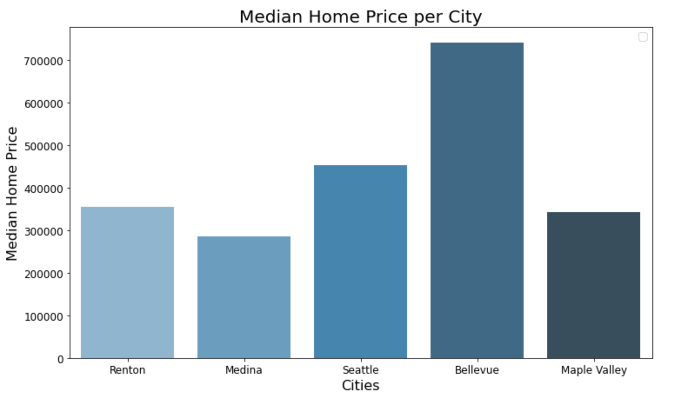

# King County Housing Price Predictions

### Predicting Home Prices in King County with Linear Regression 

**Author**: Alexandra Bruno 

## Overview

In order to conduct this research I used the King County dataset to generate a predictive linear model for home prices within the county. My final model contains 51 features that include factors such as square footage, location, how old the home is, whether it is new or renovated, and others. 

I felt that it was important to take location into account when creating the model. I was able to find the cities the homes were located by using uszipcodes. After itterating through the zipcodes and generating a list of cities I created a new feature that matched the cities with their appropriate zipcode. I then made each city into a dummy variable. 

For feature selection, I tried multiple methods such as KBest and RFE. RFE gave me the best results out of the two, but I ultimately chose the features that I ran in my OLS baseline model because they had given me the lowest RMSE. 

## Business Problem

Our goal is to predict home prices in King County. We want to do this as accurately as possible in order to avoid under valuing and over valuing homes. Both outcomes have opportunity cost that we are trying to minimize. 

## The Data

For this project uses the King County dataset. 

https://www.kingcounty.gov/services/gis/GISData.aspx

## Methods

There were no null values within the dataset so there was no cleaning done. There were a few data imputations made in order to replace extreme values with the correct information that I was able to obtain but looking up the IDs of some of the homes. 

I implemented a few statistical tests to help with the feature selection process. These tests include ANOVA and two sample t tests. Additonally I ran a baseline OLS model to get a better understand of how my features impacted my dependant variable. 

I used train test split and reviewed the RMSE scores to determine how well my model fit the data. My intial baseline model gave me the best RMSE results and I ultimately chose to use that as my final model. 

## Results

### There is variation in price from city to city 

This graphed is aligned witht the results from my ANOVA test that homes located in different cities with differ in price. 

Location is not the only factor that can cause an impact on price. I was able to generate two dummy variables that indicated if the home was new and if the home was renovated. 

The graph does indicate that the median price of a new home is higher than that of a old home. 

